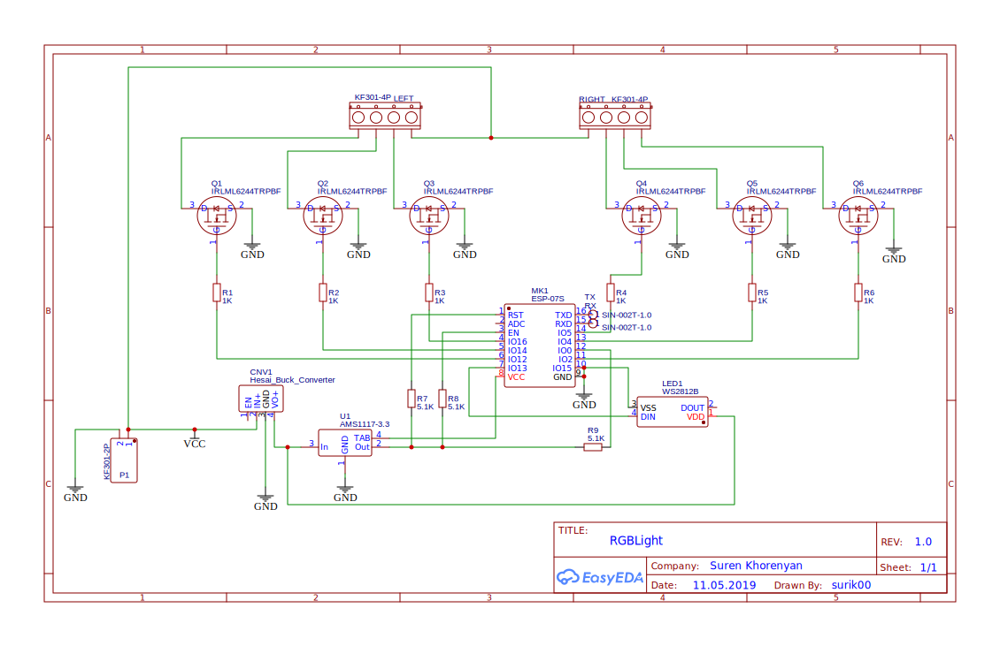

# RGBLight

This project provides software for running RGB strip controlled by HomeKit enabled devices (iOS, macOS) using ESP8266

Hardware info coming soon...

Controller's software depends on the customized ESPHelper, which has its own dependencies. The whole list of used Arduino libraries is:

- [surik00/ESPHelper](https://github.com/surik00/ESPHelper)
- [surik00/Arduino-Metro](https://github.com/surik00/Arduino-Metro)
- [knolleary/pubsubclient](https://github.com/knolleary/pubsubclient)
- [bblanchon/ArduinoJson](https://github.com/bblanchon/ArduinoJson)

Since the controller accepts prepared commands, there's another necessary part in this project - virtual HomeKit accessory running on [KhaosT/HAP-NodeJS](https://github.com/KhaosT/HAP-NodeJS). Accessories modules are provided in this repo too.

Full HOWTO coming [not very] soon...

### Schematic:

